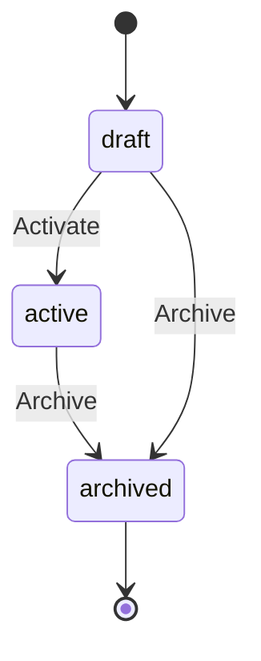
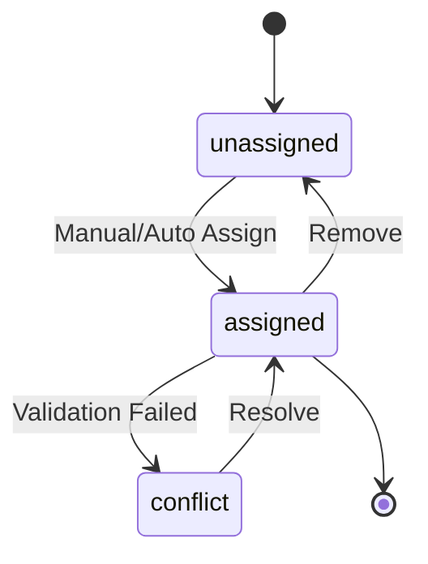

# Schedule Builder Data Model

## Entities

### Course
```typescript
interface Course {
  id: string;
  subjectId: string;
  teacherId: string | null;  // null if auto-assigned
  groupIds: string[];
  weeklyHours: number;      // default: 3
  numberOfLessons: number;  // default: 2
  createdAt: Date;
  updatedAt: Date;
}
```

### Teacher
```typescript
interface Teacher {
  id: string;
  name: string;
  subjectIds: string[];     // subjects they can teach
  workingHours: {
    start: string;          // HH:mm format, default: "08:15"
    end: string;           // HH:mm format, default: "16:00"
  };
  createdAt: Date;
  updatedAt: Date;
}
```

### Group
```typescript
interface Group {
  id: string;
  name: string;
  classId: string;
  dependentGroupIds: string[];  // groups that can't have concurrent lessons
  createdAt: Date;
  updatedAt: Date;
}
```

### Class
```typescript
interface Class {
  id: string;
  name: string;
  lunchDuration: number;    // in minutes, default: 30
  createdAt: Date;
  updatedAt: Date;
}
```

### Subject
```typescript
interface Subject {
  id: string;
  name: string;
  breakDuration: number;    // in minutes, default: 10
  createdAt: Date;
  updatedAt: Date;
}
```

### Schedule
```typescript
interface Schedule {
  id: string;
  name: string;
  weekNumber: number;
  year: number;
  status: 'draft' | 'active' | 'archived';
  lessons: Lesson[];
  createdAt: Date;
  updatedAt: Date;
}
```

### Lesson
```typescript
interface Lesson {
  id: string;
  courseId: string;
  teacherId: string;
  dayOfWeek: number;      // 1-5 (Monday-Friday)
  startTime: string;      // HH:mm format
  duration: number;       // in minutes, minimum: 45
  roomId: string | null;  // optional
  createdAt: Date;
  updatedAt: Date;
}
```

## Relationships

### One-to-Many
- Class -> Groups
- Teacher -> Lessons
- Course -> Lessons
- Schedule -> Lessons

### Many-to-Many
- Course <-> Groups (through CourseGroup)
- Teacher <-> Subjects (through TeacherSubject)
- Group <-> Groups (through GroupDependency)

## Validation Rules

### Course
- weeklyHours must be positive
- numberOfLessons must be >= 1
- must have at least one group

### Teacher
- workingHours.start must be before workingHours.end
- must be qualified for at least one subject

### Group
- cannot depend on itself
- all dependent groups must exist
- must belong to a valid class

### Lesson
- duration must be >= 45 minutes
- startTime must be within teacher's working hours
- must not overlap with dependent group lessons
- must have 10-minute break minimum between lessons
- must respect subject-specific break duration
- maximum 2 lessons per course per day

### Class
- lunchDuration must be >= 30 minutes if lessons extend past 12:30

## Indexes

```sql
-- Courses
CREATE INDEX idx_course_subject ON courses(subject_id);
CREATE INDEX idx_course_teacher ON courses(teacher_id);

-- Teachers
CREATE INDEX idx_teacher_subjects ON teacher_subjects(teacher_id, subject_id);
CREATE INDEX idx_teacher_working_hours ON teachers(working_hours);

-- Groups
CREATE INDEX idx_group_class ON groups(class_id);
CREATE INDEX idx_group_dependencies ON group_dependencies(group_id, dependent_group_id);

-- Lessons
CREATE INDEX idx_lesson_course ON lessons(course_id);
CREATE INDEX idx_lesson_teacher ON lessons(teacher_id);
CREATE INDEX idx_lesson_schedule ON lessons(schedule_id);
CREATE INDEX idx_lesson_time ON lessons(day_of_week, start_time);
```

## State Transitions

### Schedule Status


### Lesson Assignment


## Version Control
- All entities include createdAt and updatedAt timestamps
- Schedule maintains version history
- Changes tracked for audit purposes

## Data Consistency Rules
1. Cascading deletes for dependent entities
2. Referential integrity enforced at database level
3. Optimistic locking for concurrent edits
4. Transaction boundaries for related changes